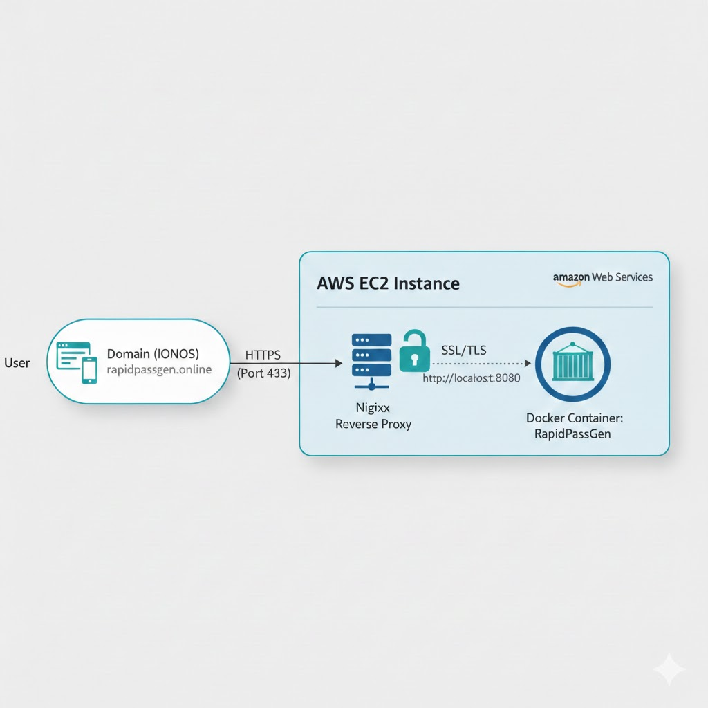
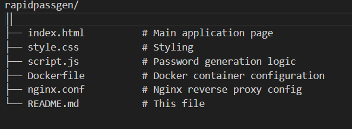

# 🔐 RapidPassGen

<div align="center">


### 🚀 **A secure, high-speed password generator deployed with professional-grade cloud infrastructure**

[**🌐 Live Demo**](https://rapidpassgen.online) | [Report Bug](#) | [Request Feature](#)

</div>

---

## 📝 Project Overview

**RapidPassGen** is a lightweight, responsive web application built with HTML5, CSS3, and JavaScript. While the frontend is simple and functional, **the core achievement of this project lies in its DevOps pipeline**:

✅ **Containerization** for environment parity  
✅ **Cloud Hosting** on AWS infrastructure  
✅ **Security Engineering** with SSL/TLS termination via Nginx  
✅ **Production-ready** deployment workflow

This project demonstrates modern cloud deployment practices, infrastructure management, and security implementation—showcasing skills essential for full-stack and DevOps roles.

---

## 🛠 Tech Stack & Tools

| **Category**          | **Technology**                           |
|-----------------------|------------------------------------------|
| **Frontend**          | HTML5, CSS3, JavaScript                  |
| **Containerization**  | Docker                                   |
| **Cloud Provider**    | AWS (EC2, ECR)                          |
| **Web Server**        | Nginx (Reverse Proxy)                    |
| **DNS / Domain**      | IONOS                                    |
| **Security**          | Let's Encrypt (Certbot)                  |
| **OS / Environment**  | Ubuntu (WSL2), Amazon Linux 2023         |

---

## 🏗 Deployment Architecture

The application follows a **modern deployment pattern** to ensure security and scalability:

### Traffic Flow:
1. **DNS Resolution**: IONOS resolves `rapidpassgen.online` to AWS Elastic IP
2. **SSL Handshake**: Nginx handles HTTPS encryption via Let's Encrypt certificate
3. **Reverse Proxy**: Nginx forwards traffic to Docker container on internal port
4. **Application**: Docker container serves the password generator

---

## 🚀 Key Implementation Details

### 🐳 Containerization

The app was containerized to ensure it runs identically on my local machine and the AWS cloud.
bash

Building the image
docker build -t rapidpassgen .

Running locally for testing
docker run -p 80:80 rapidpassgen

Tagging for AWS ECR
docker tag rapidpassgen:latest public.ecr.aws/your-registry/rapidpassgen:latest

Pushing to ECR
docker push public.ecr.aws/your-registry/rapidpassgen:latest

**Benefits:**
- ✅ Environment parity (dev = production)
- ✅ Easy rollback and versioning
- ✅ Portable across cloud providers

---

### 🔐 Security & SSL

Instead of serving the app over an insecure connection, I implemented **HTTPS**:

- ✅ Used **Certbot** to provision a **Let's Encrypt** certificate
- ✅ Configured **Nginx** to handle SSL termination and redirect all HTTP traffic to HTTPS
- ✅ Hardened the **AWS Security Group** to only allow traffic on essential ports (80, 443, 22)
nginx

Nginx SSL Configuration (snippet)
server {
    listen 443 ssl;
    server_name rapidpassgen.online;

ssl_certificate /etc/letsencrypt/live/rapidpassgen.online/fullchain.pem;
ssl_certificate_key /etc/letsencrypt/live/rapidpassgen.online/privkey.pem;

location / {
    proxy_pass http://localhost:8080;
    proxy_set_header Host $host;
    proxy_set_header X-Real-IP $remote_addr;
}
}

HTTP to HTTPS redirect
server {
    listen 80;
    server_name rapidpassgen.online;
    return 301 https://$server_name$request_uri;
}

---

### 🌐 Domain Management

Managed DNS settings within **IONOS**, pointing the domain to the AWS infrastructure:

- ✅ Configured **A-records** to point to AWS Elastic IP
- ✅ Verified domain ownership for SSL certificate issuance
- ✅ Ensured proper propagation and DNS resolution

---

## 🧠 Challenges Overcome

| **Challenge**                  | **Solution**                                                                 |
|--------------------------------|------------------------------------------------------------------------------|
| **Port Conflicts**             | Resolved issues where Nginx and Docker competed for Port 80 by implementing a **Reverse Proxy** pattern. |
| **AWS IAM Permissions**        | Configured granular IAM policies to allow the CLI to communicate securely with **ECR Public registries**. |
| **WSL2 to Cloud Workflow**     | Bridged the gap between local Windows/WSL development and remote Linux server management using Docker and SSH. |
| **SSL Certificate Renewal**    | Set up automated renewal with Certbot cron jobs to prevent certificate expiration. |

---

## 📂 Project Structure

---

## 🚦 Getting Started

### Prerequisites

- Docker installed
- AWS CLI configured (for ECR)
- Domain name (optional for local testing)

### Local Development
bash

Clone the repository
git clone https://github.com/rwitobaansheikh/Password_generator.git
cd rapidpassgen

Build Docker image
docker build -t rapidpassgen .

Run locally
docker run -p 8080:80 rapidpassgen

Access at http://localhost:8080
### Deployment to AWS
bash

Authenticate with AWS ECR
aws ecr-public get-login-password --region us-east-1 | docker login --username AWS --password-stdin public.ecr.aws

Tag and push image
docker tag rapidpassgen:latest public.ecr.aws/your-registry/rapidpassgen:latest
docker push public.ecr.aws/your-registry/rapidpassgen:latest

SSH into EC2 and pull the image
ssh -i your-key.pem ec2-user@your-ec2-ip
docker pull public.ecr.aws/your-registry/rapidpassgen:latest
docker run -d -p 8080:80 rapidpassgen:latest

---

## ⚙️ CI/CD Pipeline

A GitHub Actions workflow builds the Docker image on push to `main`, pushes the image to AWS ECR Public, and deploys to the EC2 host via SSH.

Sample workflow (`.github/workflows/ci-cd.yml`):

```yaml
name: CI/CD

on:
    push:
        branches: [ main ]

jobs:
    build-and-push:
        runs-on: ubuntu-latest
        steps:
            - uses: actions/checkout@v4
            - name: Set up QEMU
                uses: docker/setup-qemu-action@v2
            - name: Set up Docker Buildx
                uses: docker/setup-buildx-action@v2
            - name: Login to Amazon ECR Public
                uses: aws-actions/amazon-ecr-login@v2
            - name: Build and push image
                uses: docker/build-push-action@v4
                with:
                    context: .
                    push: true
                    tags: public.ecr.aws/your-registry/rapidpassgen:latest

    deploy:
        needs: build-and-push
        runs-on: ubuntu-latest
        steps:
            - name: Start SSH agent
                uses: webfactory/ssh-agent@v0.5.4
                with:
                    ssh-private-key: ${{ secrets.SSH_PRIVATE_KEY }}
            - name: Deploy to EC2
                run: |
                    ssh -o StrictHostKeyChecking=no ${{ secrets.EC2_USER }}@${{ secrets.EC2_HOST }} \
                        "docker pull public.ecr.aws/your-registry/rapidpassgen:latest && docker stop rapidpassgen || true && docker rm rapidpassgen || true && docker run -d --name rapidpassgen -p 8080:80 public.ecr.aws/your-registry/rapidpassgen:latest"
```

Required repository secrets:
- `AWS_ACCESS_KEY_ID`, `AWS_SECRET_ACCESS_KEY`
- `AWS_REGION`
- `SSH_PRIVATE_KEY`
- `EC2_HOST`, `EC2_USER`
- `ECR_REGISTRY` (optional)

Notes:
- Adjust the workflow to use ECS/Fargate, CodeDeploy, or another deployment target if preferred.
- Consider adding image scanning or testing steps before push.


## 🎯 Future Enhancements

- [ ] Add password strength meter
- [x] Implement CI/CD pipeline with GitHub Actions
- [ ] Add database for password history (encrypted)
- [ ] Implement auto-scaling with AWS ECS/Fargate
- [ ] Add monitoring with CloudWatch or Prometheus
- [ ] Multi-language support

---

## 👨‍💻 Author

**Rwitobaan**  
*Full-Stack & Cloud Engineer*

[](https://linkedin.com/in/rwitobaansheikh)
[](https://github.com/rwitobaansheikh)
---


## 🙏 Acknowledgments

- **Let's Encrypt** for free SSL certificates
- **AWS** for reliable cloud infrastructure
- **Docker** for containerization technology
- **Nginx** for powerful reverse proxy capabilities
- **Scrimba** for teaching me how to develop a fully working application
---

<div align="center">

**⭐ If you found this project helpful, please consider giving it a star!**

Made with ❤️ and ☕ by Rwitobaan

</div>
